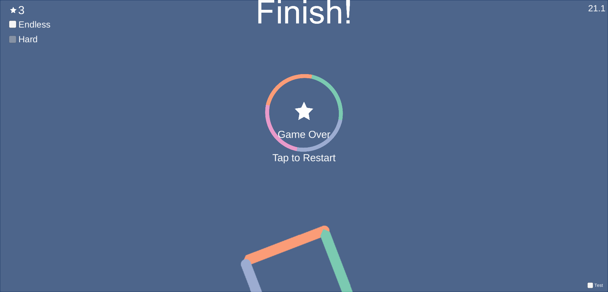

# Color Switch Game

Available at https://color-switch-game.vercel.app/
## Description

In this WebGL-based game, players navigate a ball through different obstacles. The ball can only pass through obstacles that match its current color.

## Deployment 
The project is built locally to static html files, which is hosted on Vercel. In the future, the process could be automatated with CI/CD pipeline by customizing the build environment on Vercel. 

## Future Development

### Endless mode
$Why:$
The game is ideal for endless mode due to the simplicity of its core mechanics combined with a dynamic color-switching strategy. These elements ensure the gameplay remains compelling and enjoyable, as players continually adapt to new challenges and strive to improve their skills and scores.

$How:$
To create the endless mode, develop an automatic spawning algorithm that continuously introduces new obstacles at fixed distances. This can be achieved by randomly placing obstacles while ensuring color switchers do not appear consecutively, maintaining gameplay balance and unpredictability. Additionally, the game could use player gameplay data to adjust the difficulty level, either increasing or decreasing challenges based on the player's performance.

I already implemented a draft version of endless mode, which could be activated by check 'Endless' button. I developed an algorithm for the endless random spawning and destruction of obstacles to maintain a consistent number of challenges in the game environment. Players can exit endless mode at any time by deselecting the 'Endless' button. [Link to the spawner](./Assets/Scripts/ObstacleSpawner.cs)

### More obstacles 
$Why:$ More obstacles enhance the dynamic and flexibility of gameplay, requiring players to spend more time mastering the game. New obstacles could be designed to increase player interaction and engagement by requiring direct input to influence obstacle behavior. This shift aims to make gameplay more challenging and engaging, potentially increasing replay value. 

$How:$ I have some designs for new obstacles

1. Color-Changing Obstacle: Upon player input (e.g., tapping anywhere on the screen), the obstacle changes its color following a predefined pattern. This obstacle type has been implemented under the 'Hard' mode accessible only in endless mode, reflecting its increased difficulty level. [Link to the obstacleController](./Assets/Scripts/ObstacleController.cs)

2. Visibility-Shifting Obstacle: The color of the obstacle becomes invisible when the player is moving upwards and visible only during downward movement. Access the player moving condition to change the status. 

3. Dynamic Movement Obstacle: Reacts to player inputs by moving or rotating, adding unpredictability to the obstacle course. Similar to the Color-Changing Obstacle, change the status when detect player input. 

### Personalization and Community 
$Why:$ Let the player select own colors, design own obstacles and levels. Such customization could encorage longer player sessions and build a community of content creators who can share their unique creations. 

$How:$ 
1. Color Customization:Players will be able to change colors via a simple UI input. This will interface with a centralized color list (in [GameManager](./Assets/Scripts/GameManager.cs)) used throughout the game, ensuring that any color changes are reflected universally in all game elements that use this list.

2. Obstacle Design: Players will be given a set of art prefabs representing different parts of obstacles. They can use these prefabs to assemble and customize obstacles according to their preferences. A dedicated game scene for obstacle design will be created, where players can drag and drop prefab components to construct their obstacles.
3. Level Design: A new interactive scene will be developed where players can layout their levels. This scene will feature intuitive controls for placing, rotating, and scaling game elements, providing a sandbox experience.
4. Community Build:  Includes a leaderboard and a platform for sharing user-generated levels. This feature is powered by Unity for game-side operations, such as data collection and level uploads, and a robust web stack consisting of React for the frontend, Node.js with Express for the backend, and MongoDB for database management. This setup allows players to compete on leaderboards based on points and completion times, and also to engage with levels created by other players.

